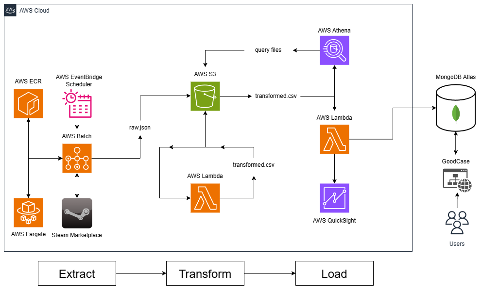

# Steam Market Data Engineer Project 🗃️

## ⭐ Table of contents

- [📄 Project Description](#project-description)
- [🏛️ Architecture](#architecture)
- [🔄 Data Pipeline](#data-pipeline)
- [🛠️ Technologies](#technologies)
- [🌐 Website](#website)
- [⚙️ Setup and Installation](#setup-and-installation)
- [📜 License](#license)

## Project Description

This project involves building a highly available and scalable data pipeline on AWS to fetch raw data from the Steam API, transform it, and store it in a database. The processed data is then loaded into AWS Athena for analysis. The project uses a variety of AWS services to ensure efficiency, scalability, and reliability.

This data pipeline is a crucial component of another project, [GoodCase](https://github.com/gizmo19/GoodCase), which is a CS gambling website built using Svelte and SvelteKit. The data is processed and uploaded to MongoDB Atlas daily because the data pipeline operates as a batch application.

## Architecture

### Components:
- **Data Sources:** The Steam API provides the raw data.
- **Ingestion Layer:** Data is ingested using AWS Batch and saved raw file in S3.
- **Processing Layer:** Data is transformed using AWS Lambda and stored in S3 Bucket.
- **Query Layer:** Data is queried using AWS Athena.
- **Storage Layer:** Update of the MongoDB Atlas (US Availability Zone) by the transformed data.

## Data Pipeline

### The data pipeline consists of the following steps:

- [x]  **Data Extraction:** AWS Batch fetch raw data from the Steam API at scheduled intervals and creates .json file in S3 Bucket.
- [x]  **Data Transformation:** The data is transformed to .csv file using AWS Lambda and then store the data in S3.
- [ ]  **Data Loading:** The transformed data is uploaded to MongoDB Atlas. MongoDB Atlas is located in a US Availability Zone to support the GoodCase website.
- [ ]  **Data Analysis:** The data stored in Amazon S3 is loaded into AWS Athena for efficient querying and analysis.

## Technologies

### Technologies Used:

- **Programming Languages:** Python, SQL
- **Data Ingestion and Processing:** AWS Lambda, AWS Batch
- **Data Storage:** Amazon S3, MongoDB Atlas
- **Data Querying and Presentation:** AWS Athena, AWS QuickSight
- **Containerization:** Docker, AWS ECR, AWS ECS
- **Version Control:** Git, GitHub

## Website

The data pipeline powers the backend of the [GoodCase](https://github.com/gizmo19/GoodCase) website.

https://good-case.vercel.app/

## Setup and Installation

### Prerequisites:
- Python 3.12.x	
	- Pandas 2.1.3
	- Requests 2.31
	- Boto3 1.34.103
- AWS Services
- Docker
- MongoDB Atlas

## License

This project is licensed under the MIT License.
